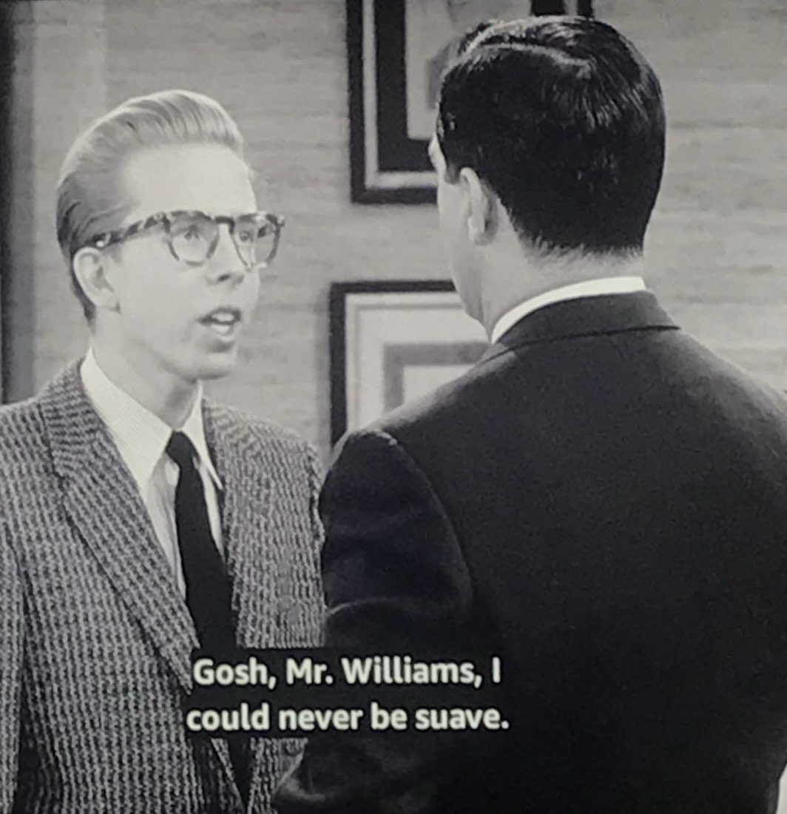

# Expand-YOYR-MIND

Research and development toward **Eval Incarnate** — a framework where language models become interpreters, filesystems become worlds, and judgment becomes a visible, editable mechanic.

---

## What's Here

### [Mayberry-A-Moral-Mecca/](Mayberry-A-Moral-Mecca/)

The book: **Eval Incarnate: A Builder's Curriculum** — 23 chapters across 5 parts, from "send programs, not data" through living worlds, the SIM-to-EVAL transition, and Speed of Light multi-turn simulation. Buildable as EPUB or HTML via `build-book.ps1`.

### [Research/](Research/)

Two working simulations built on the framework's principles:

- **[Mayberry/](Research/Mayberry/)** — _The Andy Griffith Show_ as a living world. Characters with needs, rooms with constitutions, advertisements driving autonomous behavior, and evaluation as community consensus.
- **[DannyThomasShow/](Research/DannyThomasShow/)** — _Make Room for Daddy_ as a contrasting architecture. Where Mayberry is centripetal (everything pulls inward), the Williams household is centrifugal (fixed home, rotating visitors, the performance/private boundary).

   
  <em>"Gosh, Mr. Williams, I could never be suave."</em>

Both use the same structural patterns: every folder is a room, every room has a `ROOM.yml`, key locations have `CARD.yml` advertisements, characters have inner lives, and properties cascade down the directory tree through delegation.

### [Notes/](Notes/)

Design documents, analysis, and architectural thinking:

- **EVAL-INCARNATE-FRAMEWORK.md** / **PHILOSOPHY.md** — The core framework and its philosophical grounding
- **EVAL-VS-SIM.md** — Why EVAL succeeds where SIM hits its limits
- **THE-EVALS-DESIGN.md** — Design document for evaluation as game mechanic
- **CompetitorCompared/** — Analysis of adjacent projects and how they differ
- **EVAL/** — Deep dives on the Linguistic Motherboard, PostScript history, and eval architecture
- **Podcast-Lessons/** — Audio explorations of core concepts — the Mayberry principle for AI alignment, printers as blueprints for AI, building worlds with folders, and the Eval Awakening.

### [key references.txt](key%20references.txt)

The intellectual lineage: Papert, Kay, Minsky, Wright, Hopkins, Bogost, McCloud, Postel, and the threads that connect them.

---

## Core Ideas

**Skills are programs. The LLM is `eval()`. Empathy is the interface.**

- A language model is a _linguistic motherboard_ — a universal interpreter with slots for capability cards
- Directories are rooms. YAML files are objects. The filesystem is the world.
- Objects _advertise_ what they can do. Characters choose based on their needs. Behavior emerges.
- SIM hides its assumptions. EVAL makes them visible, inspectable, and editable.
- Ethics is architecture, not policy — built into the directory structure, not bolted on after.

---

## Lineage

PostScript (1984) → NeWS (1986) → The Sims (2000) → MOOLLM (2025) → this work.
